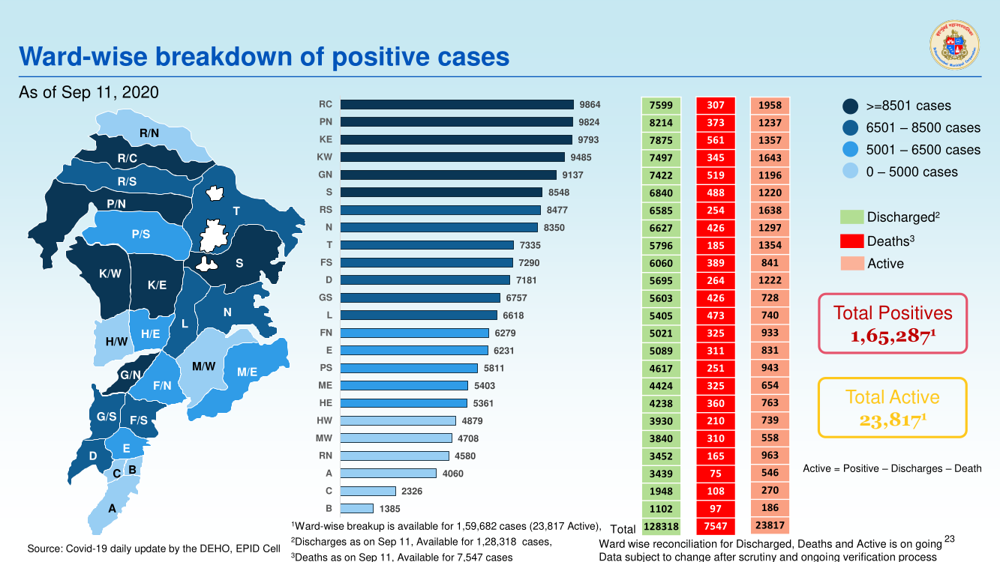
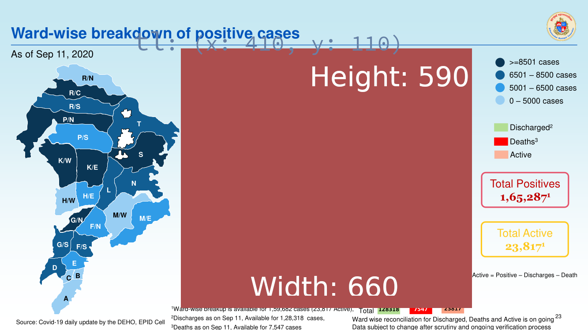

# etl-pipeline


ETL Pipeline.


## Configuring the project

We use [pipenv](https://github.com/pypa/pipenv) to manage dependencies and setup a virtualenv. 

You can install following the [project's README instructions](https://github.com/pypa/pipenv#installation) 
or using [pipx](https://pypi.org/project/pipx/).

Once installed run the following to install all dependencies:

```shell script
pipenv install
```

If using PyCharm you can configure your project to use pipenv following this guide:

- https://www.jetbrains.com/help/pycharm/pipenv.html

To add new dependencies run the following:

```shell script
pipenv install pandas numpy requests
```

Each time you install new packages the `Pipfile.lock` gets updated, however if you want to have an up to 
date `requirements.txt` you can run the following command:

```shell script
pipenv run pip freeze > requirements.txt
```


The same can be used to run the project's scripts:

```shell script
pipenv run python -m spreadsheet_fetcher sp_id
```

## Scrapping "BMC Covid-19 Response War Room Dashboard"

Based on the work from [atiyasha](https://github.com/atiyasha) for the scrapping of wards positive 
case metrics we have created a new command `pdf_scrapper` to fetch that information from the PDF 
shared from the [stop coronavirus in mumbai key updates trends file](https://stopcoronavirus.mcgm.gov.in/key-updates-trends),
you can see an example [here](./pdf_scrapper/1599967346-dashboard-example.pdf).

The `pdf_scrapper` command will accept the following arguments:

- PDF_FILES: A list of PDF files to extract data from.
- OUTPUT_PATH: The path on which we want to store the extracted data.

And allows the following options:

- `--page-with-positive-breakdown`: The page number with the ward-wise breakdown of positive cases, defaults to 22.

The command will create one csv file for each pdf pass as an argument, the result csv files will have as `filename` 
the  following: `ward-positive_<date extracted from the pdf>_<date time from when the file was created>.csv`.

For example the following command:

```
pipenv run python -m pdf_scrapper scrap-pdf pdf_scrapper/1599967346-dashboard-example.pdf csv/positive-wards
```

May result in the following files:

```
./csv/positive-wards/ward-positive_as-of-sep-11--2020_2020-09-13T05:47:18.984920+00:00.csv
```

### Data being extracted 

The following is the entire page which is going to be scrapped:



And here is the image with the section from where we extract the data: 



## Extracting history records from covid19india API and calculating metrics.

Based on the work from [saurabhmj](https://github.com/saurabhmj) we have created two new commands to fetch the historical 
data from the india covid 19 API and another to use said data to calculate the following metrics:

- `total.deceased.shift`.
- `Levitt.Metric`.
- `MA.daily.tests`.
- `MA.daily.positivity`.
- and `percent.case.growth`.

### Downloading covid19india data.

To fetch the historical data from the covid19india API we can use the following command:

```
pipenv run python data_pipeline/extract_history_command.py --history-json-url https://raw.githubusercontent.com/covid19india/api/gh-pages/v4/data-all.json --states-and-districts MH Mumbai --states-and-districs EX ExampleDistrict1,ExampleDistrict2
```

Available options:

- `--history-json-url`: The URL from which to download the historical data, defaults to `https://raw.githubusercontent.com/`
                                  covid19india/api/gh-pages/v4/data-all.json`
- `--states-and-districts`: Can be used multiple times to define the states and districts from which download data from, defaults to `MH Mumbai`
- `--output-file`: The path of the new csv file to write with this data.

### Calculating metrics based on historical data.

Once we have the each city statistics we can use the produced csv file to calculate the metrics and generate a new file with that data, to do that
we can use the following command:

```
pipenv run python data_pipeline/calculate_metrics.py --input-path data_pipeline/output/city_stats.csv --output-path foo.csv
```

Available options:

- `--input-path`: A csv that should be the result of running `extract_history_command`, contains a dataset with the historical data for multiple states and cities. 
- `--output-path`: A path on where to write the ouput csv file.

## Fetching spreadsheets

We can fetch google spreadsheet that have been **previously shared to anyone with the link** using the 
following command:

```shell script
export SPREADSHEET_API_KEY=ApiKey 
pipenv run python -m spreadsheet_fetcher 1Gp5qI7vJnrXCwiO_3K54zRVBCVyMbFoOd86YvWcRHmE vT6RKqvY0VzMaN7pKyYPyVXvUYR5cu3L5Z0sTeayDRE72xCXqVU-rhgyAucjGMJDDG5rXRKInPChqrJ 
``` 

In order to be able to run this command we first need to obtain a valid API Key which can be done following this guide:

- https://cloud.google.com/docs/authentication/api-keys

This key **MUST** be restricted to only be used with the **Google Sheet API** and preferable it should also
be restricted to certain IPs.

### TODO

Currently the script just makes fetch the spreadsheet and echo the results, for an example on how to treat the 
response to do other things like _write a csv_ look at the 
[spreadsheets_fetcher/sheets_to_csv.py](spreadsheets_fetcher/sheets_to_csv.py) file.

In the future we plan to write the data from the csv to another data storage.   

## Github Actions

### Lint

Runs a [black](https://pypi.org/project/black/) check on `pull requests` and `pushes` to github.
This workflow will fail if the following command fails:

```shell script
black --check .
```

To fix errors with the litter you can run the following command locally:

```shell script
pipenv run black .
```

That command will update your files with the _black formatting_ so it's recommended that you 
don't have anything on stage.

### fetch_spreadsheets

Fetch the spreadsheets using the `spreadsheets_fetch` module.

This requires two secrets:

- SPREADSHEET_API_KEY: Which should be the spreadsheet api key.
- SPREADSHEET_IDS: The list of spreadsheets to fetch, separated by one space eg. `id1 id2 id3 id4` 

TODO: This is still a work in progress, since we don't know what to do with the data.