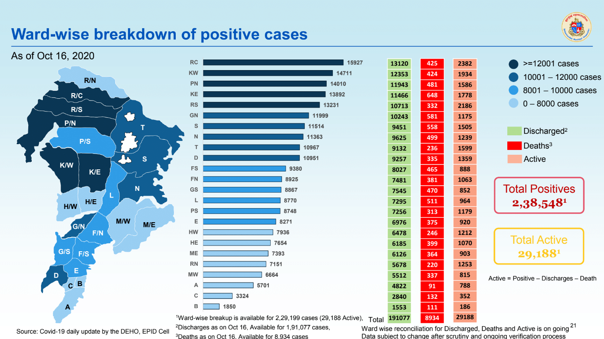
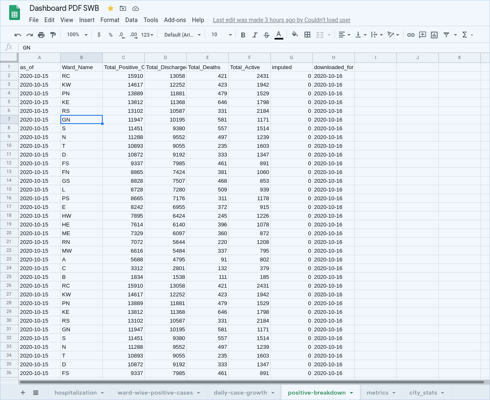
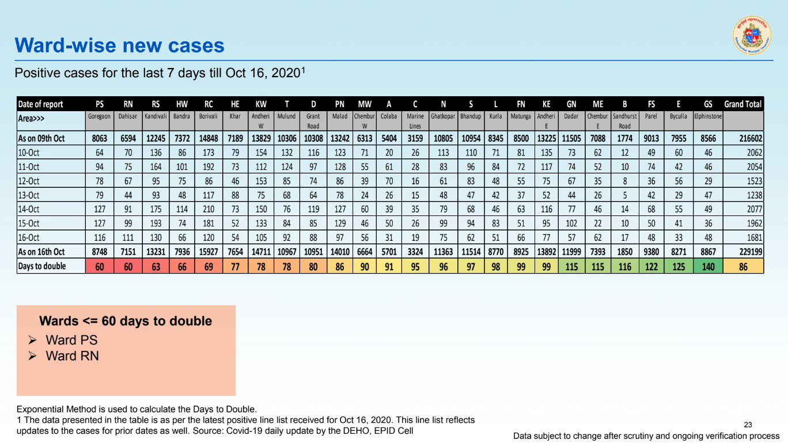
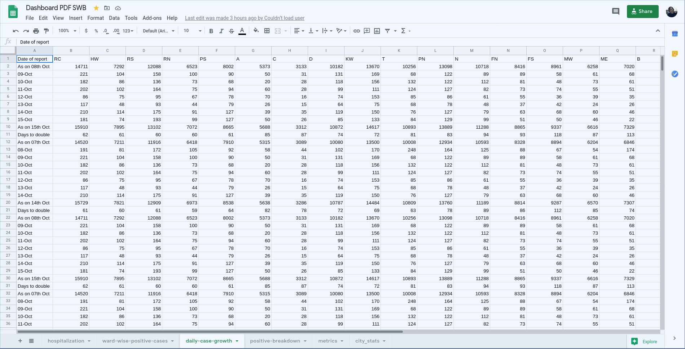
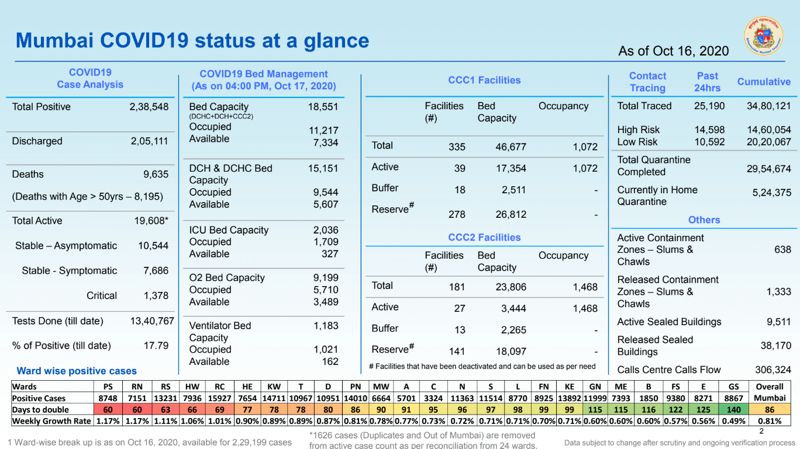
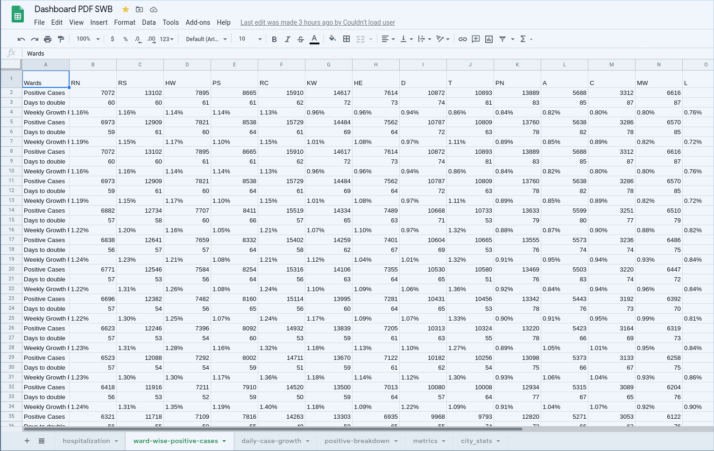
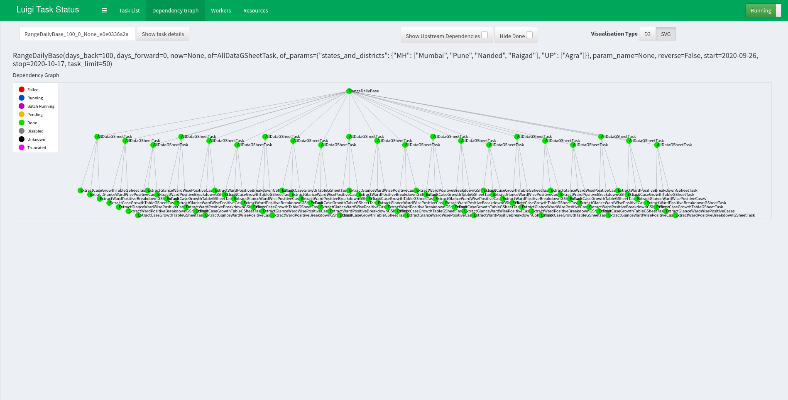
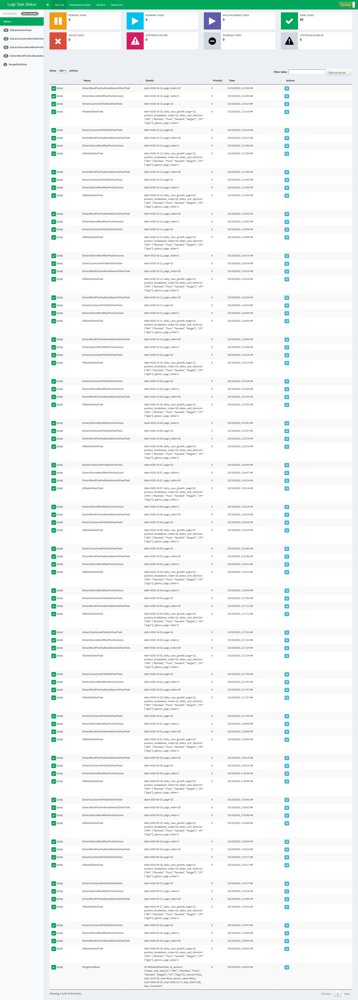

# SWB covid pipeline

This pipeline is built using luigi to schedule and organize tasks.

With luigi we are capable of declaring dependencies and use different sources
for our data.

Right now we use the `luigi.contrib.dropbox` package to store our outputs.

An output is the final target of a task, in our case is a file uploaded to dropbox.

## Environments

We only have one required environment variable for this pipeline

- `SWB_DROPBOX_TOKEN`, which should be the API token for a dropbox app that won't expire. 

## Workflows

We currently have to different workflows on for scrapping the mumbai wards pdf
and other to calculate metrics from the covid19india.org API.

### Running scrapping tasks

```sh
poetry run python -m luigi --module pipeline.tasks.stopcoronavirus_mcgm_scrapping ExtractDataFromPdfDashboardWrapper --local-scheduler
```

### Running tasks to calculate metrics from covid19india.org API

```sh
poetry run python -m luigi --module pipeline.tasks.cities_metrics CalculateMetricsTask --city-name 'Mumbai' --states-and-districts '{"MH": ["Mumbai"]}'  --local-scheduler
```

### Running all tasks

```sh
python -m luigi --module pipeline.tasks SWBPipelineWrapper  --states-and-districts '{ "MH": ["Mumbai", "Pune", "Nanded", "Raigad"], "UP": ["Agra"]  }' --date 2020-09-20 --start-date 2020-04-20
```


## Tasks

### SWBPipelineWrapper

Accepts the following parameters:

- `--date`: DateParameter, The date for which the task should run.
- `--start-date`: DateParameter, The start date for the calculate metrics script.
- `--states-and-districts`: DictParameter, a json object with the state and districts to get metrics for.
- `--elderly-page`: IntParameter, the page number for the elderly numbers page for the [stopcoronavirus mcgm pdf](http://stopcoronavirus.mcgm.gov.in/assets/docs/Dashboard.pdf).
- `--daily-case-growth-page`: IntParameter, the page number for the daily grow rate in the coronavirus mcgm pdf.
- `--positive-breakdown-index`: IntParameter, the page index for the positive breakdown of cases in the cornoavirus mcgm pdf.

It's just a wrapper for the following tasks:

- `CalculateCityMetricsTask`
- `ExtractDataFromPdfDashboardWrapper`

### CalculateCityMetricsTask

Executes the `calculate_metrics.py` script by [saurabhmj](https://github.com/saurabhmj) which fetchs values from the [covid19india](https://www.covid19india.org/) v4 API and calculate metrics for a given set of states and districts.

#### Accepts the following parameters:

##### `--date`

`DateParameter`, The date for which the task will run, defaults to `datetime.date.today()`.

It's usually mainly to define the ouput path.


##### `--start-date`

`DateParameter`, The start date for the calculate metrics script.

Doesn't defaults to anything, but a "past" date is recommended `"2020-04-20"`

##### `--states-and-districts`: 

DictParameter, a json object with the state and districts to get metrics for.

Doesn't defaults to anything, but the value can be defined as:

```
'{ "MH": ["Mumbai", "Pune", "Nanded", "Raigad"], "UP": ["Agra"]  }'
```

It Should be a string with a json dictionary of the states (keys) and the districts (string array) to get data from.

The output result is defined by a hash generated by the states and districts object.

Which means that if you run the task twice with different values in this parameter for the same `--date` you should have two different ouputs.

#### <span id="outputs-1">Outputs</span>

##### `/data/hospitalizations/hospitalizations-city-metrics.csv`

This file should get overwritten between runs, holds the hospitalizations numbers used to calculate metrics.

##### `/data/city-metrics/{state_districts_hash(self.states_and_districts)}-{self.date}-city-metrics.csv`

A file containing the metrics calculated for that date.

### <span id="pdf-dropbox" /> `ExtractDataFromPdfDashboardWrapper`

This tasks grabs the [mcgt dashboard pdf](http://stopcoronavirus.mcgm.gov.in/assets/docs/Dashboard.pdf) and scrap ward data for the wards in the district of mumbai.

#### Accepts the following parameters:

##### `--date`

A DateParameter, defaults to `datetime.date.now()` defines the for the file names.
Shouldn't be changed, since we cannot download PDFs for past dates.

##### `--elderly-page`

An IntParameter, defaults to `22`.

It may change between tasks, so it may need to be tweaked from time to time.

##### `--daily-case-growth-page`

An IntParameter, defaults to `25`


It may change between tasks, so it may need to be tweaked from time to time.

##### `--positive-breakdown-index`

An IntParameter, defaults to `22`.

Because for this script we are using `pdfplumber`, the page count starts at `0`.

It may change between tasks, so it may need to be tweaked from time to time.

#### <span id="outputs-2">Outputs</span>

##### `/data/dashboard-pdf/{self.date}-mcgm.stopcoronavirus.pdf`

The PDF downloaded by the task.

Because luigi tasks are idempotent, if the pdf exists for any given date it will not try to downloaded it again.

##### `/data/positive-wards/ward-positive-breakdown-{self.date}.csv`

The breakdown positive of positive cases scrapped from the pdf for a given date.

##### `/data/dashboard-case-growth/growth-{self.date}.csv`

Numbers for the daily growth scrapped from the pdf.

##### `/data/dashboard-elderly/elderly-{self.date}.csv`

The table of elderly cases scrapped from the pdf.

## Tasks - Google Spreadsheet

To pull and push data from the spreadsheets we are using the [gspread](https://gspread.readthedocs.io/en/latest/) package, that requires a Google API's JSON file with credentials the process has been described in the [gspread Authentication guide](https://gspread.readthedocs.io/en/latest/oauth2.html).

### Configuration

Once you have configured the authentication for gspread package we need to define the following environment variables:

- `SWB_WORKSHEET_URL`: The URL to the Google Spreadsheet, defaults to https://docs.google.com/spreadsheets/d/1HeTZKEXtSYFDNKmVEcRmF573k2ZraDb6DzgCOSXI0f0/edit#gid=0

### Workflows

Running PDF scrapping tasks:

```python
poetry run python -m luigi --module pipeline.tasks.spreadsheets ExtractDataFromPdfDashboardGSheetWrapper --date 2020-10-03  --local-scheduler
```

### Tasks

#### `ExtractDataFromPdfDashboardGSheetWrapper`

Same as [`ExtractDataFromPdfDashboardWrapper`](#pdf-dropbox) wraps other tasks that download and scrape specific pages of the Dashboard.pdf.

Wraps the following tasks:

- `ExtractWardPositiveBreakdownGSheetTask`
- `ExtractCaseGrowthTableGSheetTask`
- `ExtractElderlyTableGSheetTask`

And accepts the following parameter:

- `--date`: DateParameter, The date for which the task should run.
- `--elderly-page`: IntParameter, the page number for the elderly numbers page for the [stopcoronavirus mcgm pdf](http://stopcoronavirus.mcgm.gov.in/assets/docs/Dashboard.pdf).
- `--daily-case-growth-page`: IntParameter, the page number for the daily grow rate in the coronavirus mcgm pdf.
- `--positive-breakdown-index`: IntParameter, the page index for the positive breakdown of cases in the cornoavirus mcgm pdf.


##### Outputs

The google sheet tasks are different they do not use luigi targets, which means **they will always write** the contents scrapped to their spreadsheet pages.

#### `ExtractWardPositiveBreakdownGSheetTask`

Positive breakdown scrapping.

##### Outputs

A page named `positive-breakdown` **MUST** exists in the spreadsheet since the data will be written there.

#### `ExtractCaseGrowthTableGSheetTask`

The daily case growth table scrapping task.

##### Outputs

A page named `daily-case-growth` **MUST** exists in the spreadsheet since the data will be written there.

#### `ExtractElderlyTableGSheetTask`

Elderly data table, this page seems to have been removed from the Dashboard.pdf since Sept 25, 2020.

##### Outputs

A page named `elderly` **MUST** exists in the spreadsheet since the data will be written there.

### Running Scrapping Task for previous PDFs

By Oct 4, 2020, we had a collection of PDFs for which we haven't collected any data and no data have been added to the shared [google sheet](https://docs.google.com/spreadsheets/d/1HeTZKEXtSYFDNKmVEcRmF573k2ZraDb6DzgCOSXI0f0/edit?usp=sharing).

To ease the process we have created two scripts:

#### `move_file_with_first_page_date.py`

This script resides in the [swb-ief/dashboard-pdf-recollection](https://github.com/swb-ief/dashboard-pdf-recollection)
and is written so we can standarize the PDFs that were being created.

For example in the repo we have the following files:

- `19-09-2020.pdf`
- `stopcovid-dashboard-1600510244.pdf`
- `dashboard-9.16.20.pdf`

Each file is a PDF from the [stopcoronavirus.mcgm.gov.in Dashboard.pdf URL](http://stopcoronavirus.mcgm.gov.in/assets/docs/Dashboard.pdf) but the filename makes it difficult in some cases to know to which date it belongs, we also have the problem that for some dates the file is not updated then we may have a file with the name `19-09-2020.pdf` but in reality the content would be for the `18-09-2020`.

The scripts grabs the date from the first page of the file and uses that to create a new file `{date-in-first-page}-mcgm.stopcoronavirus.pdf`.

The name uses the same format used for the [PDF target](#outputs-2) in the `ExtractDataFromPdfDashboardWrapper`, meaning that we can upload those PDFs to take have luigi download the file when executing the pipeline.

Examples:

Assuming that the script resides in the same directory of the PDFs, you can execute the following command to copy all files to the `./pdf-with-correct-date` folder. 


```sh
ls *.pdf | xargs -L1 python ./move_file_with_first_page_date.py
```

Or if you only want to rename and copy one file you can execute the following

```sh
python ./move_file_with_first_page_date.py dashboard.pdf
```

#### `pipeline/scripts/scrap_old_pdfs_to_gsheet.py`

Intended to be used for when we have [PDF targets](#outputs-2) for which we haven't collected data.

It accepts a CSV as an argument the file should contain the following headers:

- `date-of-pdf`: the date that appers in the PDF name
- `elderly-table-page`: the page of the elderly table
- `positive-breakdown-page`: the page of the positive breakdown table
- `case-growth-page`: the page of the daily case growth table


The idea is that we would be able to list the pending files in the CSV and use this script to execute the Luigi tasks related to scraping for each one of them. 

We need to list the page numbers because they differ for some dates or as in the case for the `elderly-table-page` they are removed.

For example by Oct 04 none of the PDF files have been scrapped and pushed to the shared [spreadsheet](https://docs.google.com/spreadsheets/d/1HeTZKEXtSYFDNKmVEcRmF573k2ZraDb6DzgCOSXI0f0/edit?usp=sharing), because we already had all files in the [target directory](https://www.dropbox.com/sh/syvpyxmt0zrm0ib/AACc95ZIiBXBl2SUw4nw5ls1a?dl=0) we can run create a file similar to the following:

- https://docs.google.com/spreadsheets/d/1EJHOwRYqu_Hdl4AGYKWf1xaOwGtwQhR8qE2VcmMtstA/edit?usp=sharing

The idea is that each row should contain the parameters for the `pipeline.spreadsheets.ExtractDataFromPdfDashboardGSheetWrapper` task.

Here's the command run for the CSV shown before:

```bash
poetry run python pipeline/scripts/scrap_old_pdfs_to_gsheet.py https://docs.google.com/spreadsheets/d/e/2PACX-1vRW7z5f_VCMc3exP2RKnriuqJkiBhNpyjIbjIG6HRqWB5_9ey6ZYtFOs9Car8nK5ibNGSiUjbW-bmx5/pub\?gid\=0\&single\=true\&output\=csv
```

And this is the command output:

```
===== Luigi Execution Summary =====

Scheduled 120 tasks of which:
* 100 ran successfully:
    - 29 ExtractCaseGrowthTableGSheetTask(date=2020-08-24, page=24) ...
    - 20 ExtractDataFromPdfDashboardGSheetWrapper(...)
    - 21 ExtractElderlyTableGSheetTask(date=2020-08-24, page=21) ...
    - 30 ExtractWardPositiveBreakdownGSheetTask(date=2020-08-24, page_index=21) ...
* 10 failed:
    - 1 ExtractCaseGrowthTableGSheetTask(date=2020-09-16, page=25)
    - 9 ExtractElderlyTableGSheetTask(date=2020-09-26...2020-10-04, page=-1)
* 10 were left pending, among these:
    * 10 had failed dependencies:
        - 10 ExtractDataFromPdfDashboardGSheetWrapper(...)

This progress looks :( because there were failed tasks

===== Luigi Execution Summary =====
```

The first thing to notice is that 10 tasks failed, _9_ of them are related to the *elderly* page being **removed** from the _Dashboard.pdf_ and just one is related to the case growth scrapping `1 ExtractCaseGrowthTableGSheetTask(date=2020-09-16, page=25)` because luigi prints the parameters with which the task was run we can debug and run that task manually:

```sh
poetry run python -m luigi --module pipeline.tasks.spreadsheets ExtractCaseGrowthTableGSheetTask --date 2020-09-16 --page 25  --local-scheduler
```
The page fails with the following exception:

```
ERROR - [pid 218167] Worker Worker(salt=222123241, workers=1, host=rscnt-dell-laptop, username=rscnt, pid=218167) failed    ExtractCaseGrowthTableGSheetTask(date=2020-09-16, page=25)
Traceback (most recent call last):
  File "/home/rscnt/.cache/pypoetry/virtualenvs/pipeline-dIf6zzCi-py3.8/lib/python3.8/site-packages/luigi/worker.py", line 191, in run
    new_deps = self._run_get_new_deps()
  File "/home/rscnt/.cache/pypoetry/virtualenvs/pipeline-dIf6zzCi-py3.8/lib/python3.8/site-packages/luigi/worker.py", line 144, in _run_get_new_deps
    requires = task_gen.send(next_send)
  File "/home/rscnt/work/destruction.io/swb/covid-dashboard/etl-pipeline/pipeline/pipeline/tasks/spreadsheets.py", line 82, in run
    scrap_df = scrape_case_growth_to_df(named_tmp_file.name, page=self.page)
  File "/home/rscnt/work/destruction.io/swb/covid-dashboard/etl-pipeline/pipeline/pipeline/dashboard_pdf_scrapper.py", line 169, in scrape_case_growth_to_df
    if not (new_cases.columns == nc_expected_header).all():
  File "/home/rscnt/.cache/pypoetry/virtualenvs/pipeline-dIf6zzCi-py3.8/lib/python3.8/site-packages/pandas/core/indexes/base.py", line 136, in cmp_method
    result = ops.comp_method_OBJECT_ARRAY(op, self._values, other)
  File "/home/rscnt/.cache/pypoetry/virtualenvs/pipeline-dIf6zzCi-py3.8/lib/python3.8/site-packages/pandas/core/ops/array_ops.py", line 52, in comp_method_OBJECT_ARRAY
    raise ValueError("Shapes must match", x.shape, y.shape)
ValueError: ('Shapes must match', (27,), (26,))
```

And it's because apparently the scrapper found there are more columns than expected in the PDF:

```python
(Pdb) new_cases.columns.tolist()
['Date of report', 'RC', 'RN', 'KW', 'RS', 'HW', 'D', 'Unnamed: 7', 'T', 'PS', 'B', 'MW', 'PN', 'FN', 'HE', 'C', 'ME', 'KE', 'A', 'N', 'E', 'GN', 'GS', 'FS', 'S', 'L', 'Grand Total']
(Pdb) nc_expected_header
['Date of report', 'RC', 'HW', 'RS', 'RN', 'PS', 'A', 'C', 'D', 'KW', 'T', 'PN', 'N', 'FN', 'FS', 'MW', 'ME', 'B', 'E', 'GS', 'KE', 'GN', 'S', 'HE', 'L', 'Grand Total']
(Pdb) new_cases.columns == nc_expected_header
*** ValueError: ('Shapes must match', (27,), (26,))
```

It fails because the downloaded PDF contains the following column: `'Unnamed: 7'`.

After making the changes we can re-run the command:

```python
poetry run python -m luigi --module pipeline.tasks.spreadsheets ExtractCaseGrowthTableGSheetTask --date 2020-09-16 --page 25  --local-scheduler
```

And the output:

```python
===== Luigi Execution Summary =====

Scheduled 1 tasks of which:
* 1 ran successfully:
    - 1 ExtractCaseGrowthTableGSheetTask(date=2020-09-16, page=25)

This progress looks :) because there were no failed tasks or missing dependencies

===== Luigi Execution Summary =====
```


#### `AllDataGSheetTask`

This is a wrapper tasks that not only runs the PDF scrapping but also the metrics calculation using the india19covid.org API.

In runs the following tasks:

- `ExtractWardPositiveBreakdownGSheetTask`

  Extracts numbers in the "Ward wise breakdown of positive cases"

  

  And adds them to a spreadsheet page with the title `positive-breakdown`

  

  Columns:

  - as_of: The date that appears in the page, in this case it would be `2020-10-15`.
  - Ward_Name: The abbreviation of the ward (eg. RC, KW...)
  - Total_Positive_Cases: The numbers at the side of each bar.
  - Total_Discharged: The numbers with a green background.
  - Total_Deaths: The numbers with a red background.
  - Total_Active: The numbers with a salmon background.
  - imputed: A boolean field to mark if the values has been imputed. `0` for false, `1` for true.
  - downloaded_for: The date for which the data was scrapped, the value of the date parameter in the task. 

- `ExtractCaseGrowthTableGSheetTask`

  Extracts numbers in the "Ward-wise new cases" table.

  

  And adds them to a spreadsheet page with the title `daily-case-growth`

  

  Columns:

  - Date of report: As in the table.
  - RC	
  - HW	
  - RS	
  - RN	
  - PS	
  - A	
  - C	
  - D	
  - KW	
  - T	
  - PN	
  - N	
  - FN	
  - FS	
  - MW	
  - ME	
  - B	
  - E	
  - GS	
  - KE	
  - GN	
  - S	
  - HE	
  - L	
  - Grand Total: The total of the numbers for that week in each ward.
  - downloaded_for: The date for which the task was run.

  The columns that do not have a description, the name represent the ward abbreviation.

- `ExtractGlanceWardWisePositiveCases`

  Extracts the table with the title "Ward wise positive cases"

  


  

  Columns:

  - Wards	
  - RN	
  - RS	
  - HW	
  - PS	
  - RC	
  - KW	
  - HE	
  - D	
  - T	
  - PN	
  - A	
  - C	
  - MW	
  - L	
  - FN	
  - KE	
  - N	
  - S	
  - E	
  - GN	
  - B	
  - ME	
  - FS	
  - GS	
  - "Overall Mumbai"	
  - downloaded_for

  **NOTE** With this spreadsheet we may have an issue, since we would need to transform the columns to a way we could represent it.

  Maybe have the following columns:

  - Ward: The ward abbreviation
  - Positive Cases: The value of the positive cases for that ward.
  - Days to double: The value of days to double for that ward.
  - Weekly Growth Rate: The value for the ward.

  Basically transpose the current table, the same may be needed for "Ward-wise new cases".

- `HospitalizationSheetGSheetTask`

  Takes data from the covid19india.org API and transform it to the metrics the dashboards needs.

  1. Fetchs the [latest data](https://raw.githubusercontent.com/covid19india/api/gh-pages/v4/data-all.json) of the covid india project for all states and districts and stores it on dropbox.
  2. Fetch the data from `hospitalization` sheet, if any.
  3. Executes the function `pipeline.calculate_metrics_file.extract_history` with the existing hospitalization data.
  4. With the results updates the `hospitalization` sheet.
  5. Updates the `city_stats` sheet.
  6. And finally makes an update to the `metrics` sheet.
 


Task for 2020-09-26 to 2020-10-17

```sh
poetry run python -m luigi \
  --module pipeline.tasks.spreadsheets RangeDailyBase \
  --of AllDataGSheetTask --start 2020-09-26  \
  --stop 2020-10-17   \
  --of-params '{ "states_and_districts": { "MH": ["Mumbai", "Pune", "Nanded", "Raigad"], "UP": ["Agra"]  } }'
```

Output

```python
===== Luigi Execution Summary =====

Scheduled 85 tasks of which:
* 85 ran successfully:
    - 21 AllDataGSheetTask(...)
    - 21 ExtractCaseGrowthTableGSheetTask(date=2020-09-26...2020-10-16, page=23)
    - 21 ExtractGlanceWardWisePositiveCases(date=2020-09-26...2020-10-16, page_index=1)
    - 21 ExtractWardPositiveBreakdownGSheetTask(date=2020-09-26...2020-10-16, page_index=20)
    - 1 RangeDailyBase(...)

This progress looks :) because there were no failed tasks or missing dependencies

===== Luigi Execution Summary =====

INFO -
===== Luigi Execution Summary =====

Scheduled 85 tasks of which:
* 85 ran successfully:
    - 21 AllDataGSheetTask(...)
    - 21 ExtractCaseGrowthTableGSheetTask(date=2020-09-26...2020-10-16, page=23)
    - 21 ExtractGlanceWardWisePositiveCases(date=2020-09-26...2020-10-16, page_index=1)
    - 21 ExtractWardPositiveBreakdownGSheetTask(date=2020-09-26...2020-10-16, page_index=20)
    - 1 RangeDailyBase(...)

This progress looks :) because there were no failed tasks or missing dependencies

===== Luigi Execution Summary =====
```

Screenshots from the luigi server to this task.

Graph of tasks:



List of tasks:




We don't have a luigi server but if we could get one it would be possible for us to have a history of the tasks that have been run.